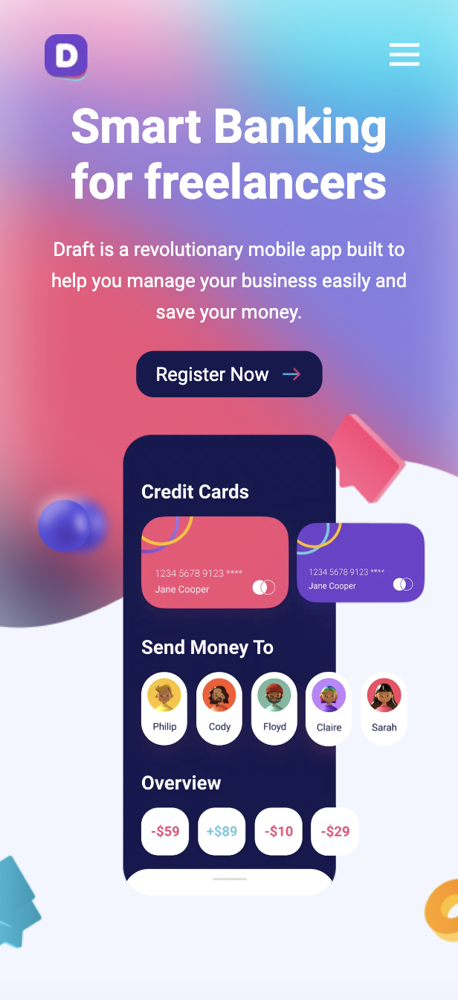
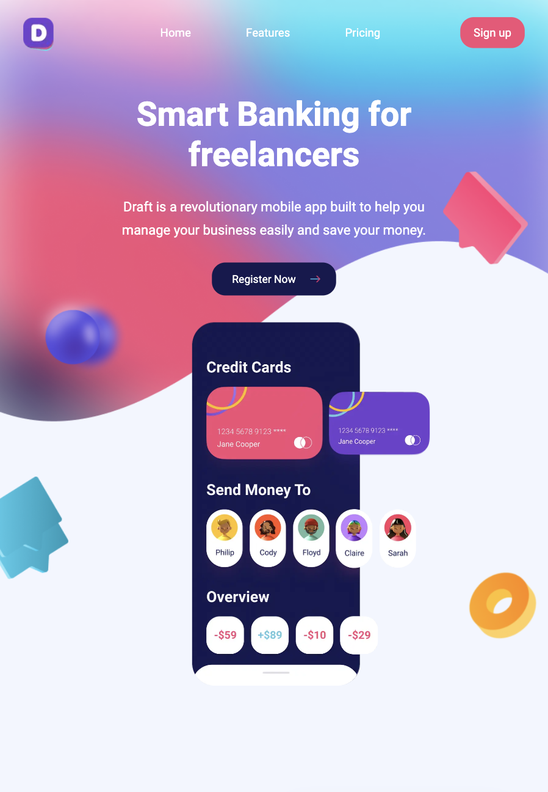
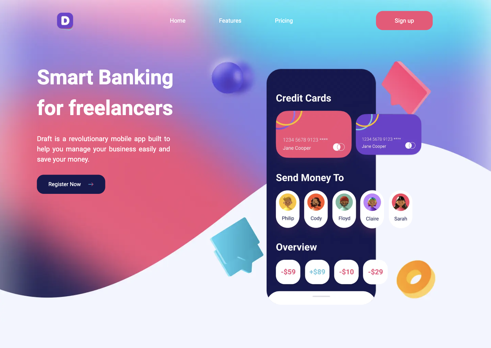
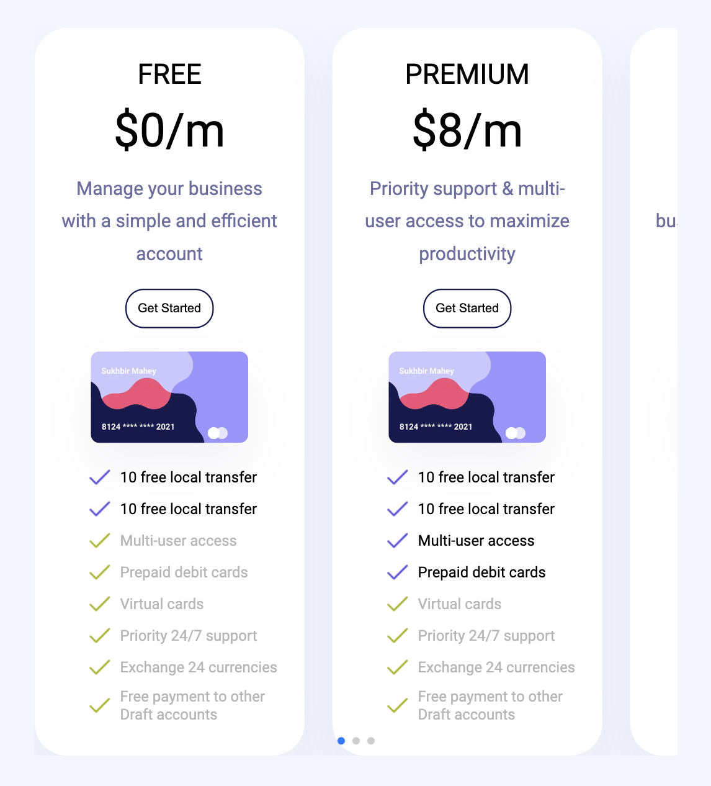
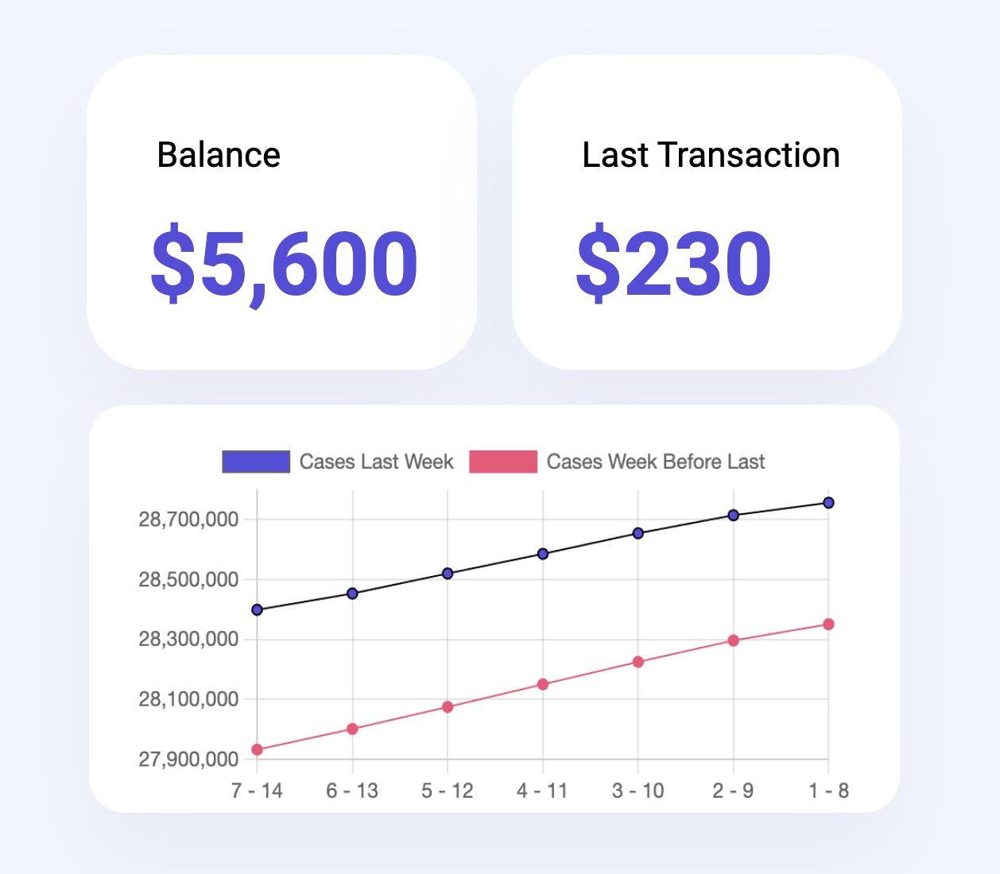

# SEAT:CODE CSS CHALLENGE

## Summary
This is a project that includes a Front-end Landing Page built with HTML5, LESS (CSS3), JS, and lots of love. 
This exercise is part of the hiring process for the AEM Frontend position at SEAT:CODE. It is meant to provide credibility in a range of both hard and soft skills:
- HTML5, LESS (CSS3), Vanilla JS
- BEM Methodology
- Responsive Design
- Critical thinking
- UX/UI
- SEO / Accessibility / Performance / Animations

## Digging deeper

The task for this challenge was pretty straightforward. I had to implement the layout (HTML and CSS) and some functionalities in JavaScript for the following prototype.
View design file → [Figma](https://www.figma.com/file/FmIcd7edEvkQGysnQljlvy/Seat-Code---Websites---FE?type=design&node-id=0%3A1&mode=design&t=hZZCcupdg6VNUSiO-1). 

On top of that, if I could, I had to also implement a couple of bonus exercises that consisted in:
- Using the API [Covid Tracking](https://covidtracking.com/data/api), display on the graph the
number of cases (first day with data/same day one week before) for the last 7
days.
- On the card section, add more than 2 cards with a swiper.

## Technologies Used

-  HTML
-  LESS
-  CSS
-  JavaScript

## Getting Started

If you want to just visit the landing page, you can click on the following [link](https://muvildan.github.io/SEAT_CODE-CSS/).

Else if you'd like to have debugging control over my project, you can follow these steps: 

1. Clone the repository to your local machine.
2. Navigate to the cloned repository.
3. On VSCode, download the [Live Server](https://marketplace.visualstudio.com/items?itemName=ritwickdey.LiveServer) extension to view the page without having to create a server.
4. After installing it, with the HTML file opened on VSCode, you can click on "Go Live" in the bottom-right corner of the IDE and the extension will find an available port to host the local server for you.
5. Now, here comes the debugging part. First, you'll need to do an npm install at the root level of the project to install the LESS compiler.
```
$ npm install
```
6. Then, you can change the LESS files and trigger and compile them again into CSS using the following command:
```
$ lessc ./less/styles.less ./styles/styles.css
```
7. Thanks for taking the time to review my challenge! Feedback will be greatly appreciated. 🙂 

## Thoughts

Having the wireframes and actual high-res frames for the desktop view but having to code this mobile-first has been a challenge. It has pushed me to make me think as a designer and has helped me be aware of lots of important matters.

I am happy that I could complete both bonuses. I would have liked to generate the swiper myself, but I decided I'd better use that time to demonstrate HTLM and CSS skills, and the ability to communicate with APIs (first bonus).

For the sake of providing good SEO conversion, I have chosen several keywords that I've included on my Head metadata. On top of that, I have made sure to provide other metadata like the title, description, author, language, viewport size, and scale...

Also, with accessibility in mind, I have tried to make sound use of the alt property of images, and I have made use of specific element tags, from the most usual ones like the div, to some rare ones like summary, details, or canvas.

Performance-wise, I decided to only use WEBP images so that I could reduce as much as possible the loading time for assets and their memory usage. On that line, most animations have been coded by myself (except for the swiper), like the accordions for the FAQ section, which recently received this new feature!

Last but not least, if I had to point out something I'd improve, I'd say the header section of the mobile view. Unfortunately, I did not have time to implement a hamburger menu for its navigation bar, but I am fully aware that's the n1 priority that'd fall on my backlog.

I hope you enjoyed the result. I would greatly appreciate having feedback on what I could improve or iterate from here onwards.

## Backlog

1. Hamburger nav bar for mobile view
2. LESS refactor + use of mixins
3. Loading view while data is being fetched

## Screenshots
Here are some screenshots from the project:


*Mobile view*


*Tablet view*


*Desktop view*


*Swiper for tablets*


*Graph for desktop*
